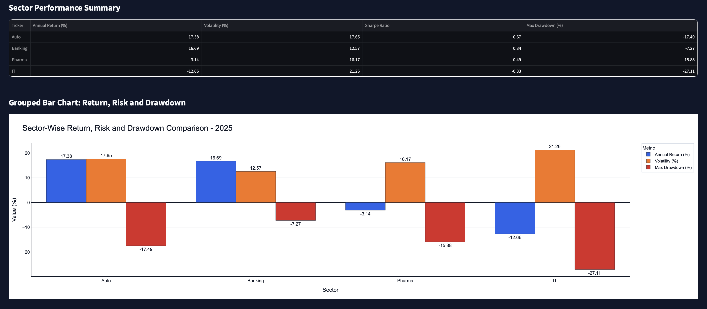
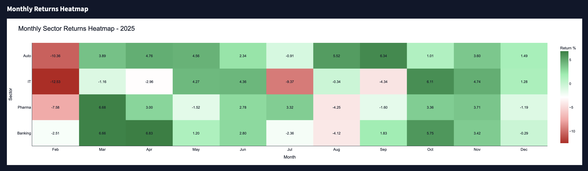
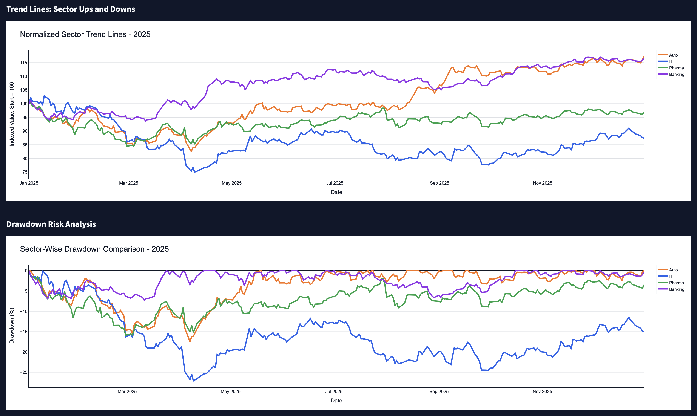
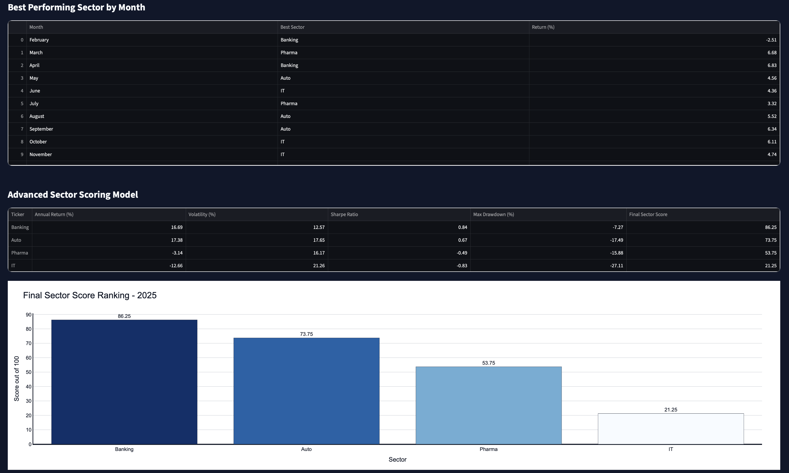

# 🇮🇳 India Sector-Wise Market Performance & Risk Analytics Dashboard

An interactive financial analytics dashboard for analyzing and comparing the performance of major Indian market sectors including **IT, Banking, Pharma, and Auto**.

The dashboard combines **financial performance analysis, risk measurement, interactive visualization, and automated insights** to identify which sectors performed best during a selected year.

---

## 📊 Project Overview

Different sectors of the Indian stock market can perform very differently depending on economic conditions, interest rates, market sentiment, corporate earnings, and industry-specific factors.

This project analyzes major Indian sectoral indices and provides a comprehensive comparison based on both **returns and risk**.

Instead of evaluating a sector only by its annual return, the dashboard considers:

- Annual Return
- Volatility
- Sharpe Ratio
- Maximum Drawdown
- Monthly Returns
- Price Trends
- Risk-Adjusted Performance
- Overall Sector Score

The objective is to provide a more complete view of sector performance and demonstrate how financial market data can be transformed into meaningful investment insights.

---

## 🎯 Project Objectives

- Compare the performance of major Indian market sectors
- Identify the best-performing sector in a selected year
- Analyze monthly sector returns
- Measure sector volatility and market risk
- Evaluate risk-adjusted performance using the Sharpe Ratio
- Analyze maximum drawdowns
- Visualize sector trends using interactive charts
- Rank sectors using a custom scoring model
- Generate automated financial insights
- Provide downloadable analytical datasets

---

## 🏦 Sectors Analyzed

| Sector | Indian Market Index |
|---|---|
| 💻 IT | Nifty IT |
| 🏦 Banking | Nifty Bank |
| 💊 Pharma | Nifty Pharma |
| 🚗 Auto | Nifty Auto |

The dashboard allows users to select the sectors they want to analyze.

---

# 📈 Dashboard Features

## 1. Sector Performance Summary

The dashboard provides an overview of each selected sector using:

- Annual Return (%)
- Volatility (%)
- Sharpe Ratio
- Maximum Drawdown (%)

This makes it possible to compare sectors not only by their returns but also by the amount of risk taken to achieve those returns.

---

## 2. Grouped Bar Chart

The grouped bar chart compares:

- Annual Return
- Volatility
- Maximum Drawdown

across the selected sectors.

This provides a quick visual comparison of sector performance and risk.

### Example



---

## 3. Monthly Returns Heatmap

The monthly returns heatmap shows how each sector performed during individual months of the selected year.

- 🟢 Green → Positive returns
- 🔴 Red → Negative returns
- ⚪ White → Returns close to zero

This helps identify:

- Strong months
- Weak months
- Sector-specific momentum
- Periods of market stress
- Sector rotation patterns

### Example



---

## 4. Normalized Sector Trend Analysis

Each sector is normalized to a starting value of **100**.

This allows sectors with different index levels to be compared on the same scale.

For example:

> If a sector reaches 120, it means the sector increased approximately 20% from its starting value.

The trend chart helps identify:

- Long-term momentum
- Relative sector performance
- Periods of outperformance
- Market corrections

### Example



---

## 5. Drawdown Analysis

Maximum drawdown measures the largest decline from a previous peak.

The drawdown analysis helps identify sectors that experienced significant downside risk during the selected period.

A lower drawdown generally indicates better downside protection during market declines.

---

## 6. Advanced Sector Scoring Model

The project includes a custom sector ranking framework.

Each sector receives a score based on:

| Component | Weight |
|---|---:|
| Annual Return | 40% |
| Sharpe Ratio | 30% |
| Volatility | 15% |
| Drawdown | 15% |

The final score provides a combined view of **performance and risk**.

This prevents the analysis from simply selecting the sector with the highest return.

### Example



---

## 7. Automated Insights

The dashboard automatically identifies:

- 🏆 Best-performing sector
- 📉 Worst-performing sector
- 🛡️ Lowest-risk sector
- ⚡ Most volatile sector
- 📊 Best risk-adjusted sector
- 📈 Best overall sector according to the scoring model

This converts raw financial data into easier-to-understand conclusions.

---

## 8. Downloadable Data

Users can download:

- Sector summary data
- Monthly returns
- Sector scores

in CSV format for further analysis in Excel, Python, Power BI, or other analytics tools.

---

# 📊 Financial Metrics Explained

## Annual Return

Measures the percentage change in the sector index during the selected year.

```text
Annual Return =
(Ending Price / Starting Price - 1) × 100
